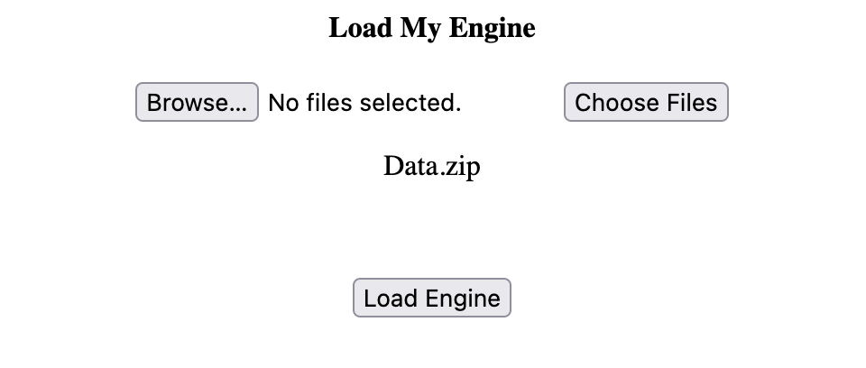
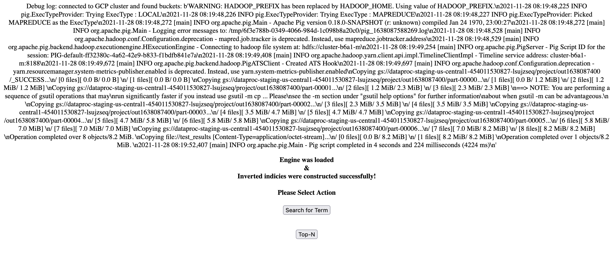
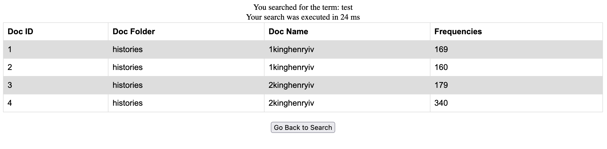
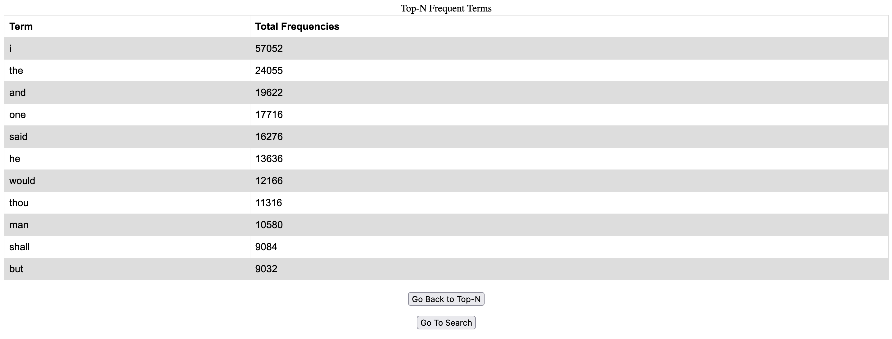

# Course Project Option-II

## Connect to GCP

Since this project uses a python Flask backend, first we need Docker to install all the necessary packages when building the image, in `requirements.txt` we have

```
Werkzeug==0.16.1
Flask==0.12.2
google-api-python-client==2.28.0
google-cloud-storage==1.42.3
```

Which will install `Werkzeug`, `Flask`, as well as `google-api-python-client` and `google-cloud-storage`, the latter two are used to connect to GCP.

The JSON key file is generated through steps in [this doc](https://cloud.google.com/docs/authentication/getting-started). The JSON key file is saved in the `/backend` directory. Since `/backend` is copied when building the docker image.

In `Dockerfile`, set the environment variable `GOOGLE_APPLICATION_CREDENTIALS` to the path of the JSON key file, before the `RUN` command.

``` docker
FROM python:3.6-slim
COPY backend /app
WORKDIR /app
ENV GOOGLE_APPLICATION_CREDENTIALS /app/course-project-suyanx-dcb09145387c.json
RUN pip3 install -r requirements.txt
EXPOSE 5001
ENTRYPOINT ["python3"]
CMD ["index.py"]

```

After files are selected and `Load Engine` is click (see screenshot below), the following python code will be executed. Noet the second application on GCP hasn't been created yet, here we only conneced to theGCP project and print out the buckets in that project.

``` python
@app.route('/constructor', methods = ['GET', 'POST'])
def constructor(): 
        # here we connect with the 2nd application in GCP
        storage_client = storage.Client()
        buckets = list(storage_client.list_buckets())
        print(buckets)
        return render_template('construct.html', buckets = buckets)
```

For the next step, after the second application is created, I will use targeted HTTP requests in GCP to handle further communication between client application and GCP cluster. This is handled by GCP through URLs in the format of `
https://VERSION-dot-SERVICE-dot-PROJECT_ID.REGION_ID.r.appspot.com
`. The current idea is to create another Flask app on GCP (without GUI), and handles the incoming requests, executes the algorithm, calculate the results, and return the results. 

## Run client-side application

The client side application uses python Flask

1. Clone this repository

2. Go into the directory that contains the Dockerfile, build the docker image 

``` sh
docker build -t [your dockerhub id]/app1 .
```

3. Run the docker image

``` sh
docker run -d --name app1 -p 5001:5001 [your dockerhub id]/app1
```

4. Open http://0.0.0.0:5001 in a web browser, this will lead you to the main page to upload files



5. Click on `Load Engine` button to reach the menu. Here we used the `GOOGLE_APPLICATION_CREDENTIALS` environment variable to authenticate and connect with GCP, a list of available buckets under the project is print on the page



6. Click on `Search for Term` to enter the search page, click on `Search` to enter the search result page. The results currently are hardcoded. Once the second application is completed, the table will parse and show the results returned from the GCP application.




7. Click on `Top-N` to enter the N input page, click on `Search` to enter the Top N result page. The results currently are hardcoded. Once the second application is completed, the table will parse and show the results returned from the GCP application.


