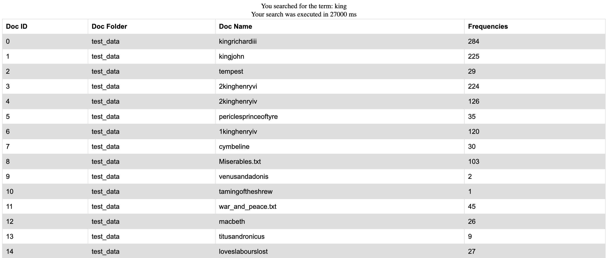
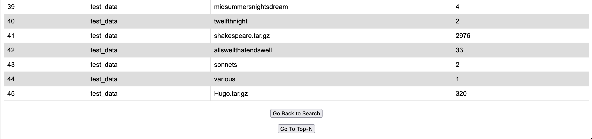

# Course Project Option-II

**Video URL: https://drive.google.com/file/d/1mB6Y89KACvUQ5I0PmfKzw-qIf9IoQGh8/view?usp=sharing**

---

## Introduction

### Python Dependencies 

Since this project uses a python Flask backend, first we need Docker to install all the necessary packages when building the image, in `requirements.txt` we have

```
Werkzeug==0.16.1
Flask==0.12.2
google-api-python-client==2.28.0
google-cloud-storage==1.42.3
google-cloud-dataproc==3.1.1
```

Which will install `Werkzeug`, `Flask`, as well as `google-api-python-client`, `google-cloud-storage` adn `google-cloud-dataproc`, the latter three are used to connect to GCP.

### Connecting to GCP

The JSON key file is generated through steps in [this doc](https://cloud.google.com/docs/authentication/getting-started). The JSON key file is saved in the `/backend` directory. Since `/backend` is copied when building the docker image.

In `Dockerfile`, set the environment variable `GOOGLE_APPLICATION_CREDENTIALS` to the path of the JSON key file, before the `RUN` command.

``` docker
FROM python:3.6-slim
COPY backend /app
WORKDIR /app
ENV GOOGLE_APPLICATION_CREDENTIALS /app/course-project-suyanx-dcb09145387c.json
RUN pip3 install -r requirements.txt
EXPOSE 5001
ENTRYPOINT ["python3"]
CMD ["index.py"]

```

### Functionalities

#### a. Upload data and construct inverted indices with MapReduce

After files are selected and `Load Engine` is click (see screenshot below), the `constructor()` method in `index.py`. This method will:

1. connect with GCP storage, and save the selected files into the bucket associated with the Hadoop application cluster

2. use the Python Dataproc API to submit a Hadoop job to the cluster

3. submit a Pig job and merge the results from different reducers and copied the merged result file in the bucket.

Mapreduce is performed on GCP cluster using `project_mapper.py` and `project_reducer.py`.

The mapreduce output has the following format: `word    {'doc_folder1/doc_name1':occurrence_in_doc}     total_occurrence`, example:

```
adobe	{'test_data/file_name': 2}       2 
```

The postings are organized as a Python dictionary structure, where the key is the file path and value is the number of occurrences in this file. The total occurrences counts all occurrences across all uploaded files.

#### b. Search term/keyword

After Hadoop application is executed, when the Search Term functionality is called, the `search_term()` method in `index.py` is invoked. A Pig job is submitted to run a search on the merged results, the search results are copied to the bucket.

#### c. Retrieve top n more frequent terms

After Hadoop application is executed, when the Top N functionality is called, the `top_n()` method in `index.py` is invoked. A Pig job is submitted to run a sort on the merged results, sort based on number of total occurrences of the term, the first N terms with the highest occurrences are saved into a results file and copied to the bucket.

---

## Run client-side application with Docker

The client side application uses Python Flask

1. Clone this repository. Since I cannot commit my JSON keyfile to GitHub (essential for making the application work), I have uploaded it to drive: https://drive.google.com/file/d/19-6J3oy_14FaIf0De2675yHUXPx7Xmeh/view?usp=sharing . Please downlooad this JSON keyfile and store it in the `/14848-Course-Project/backend` directory

2. Go into the directory that contains the Dockerfile, build the docker image 

``` sh
docker build -t [your dockerhub id]/app1 .
```

Alternatively, you could use the public docker image on DockerHub, without having to add the JSON keyfile, URL: https://hub.docker.com/r/suyanxv/app1, command:

```sh
docker pull suyanxv/app1
```

3. Run the docker image

``` sh
docker run -d --name app1 -p 5001:5001 [your dockerhub id]/app1
```

or if using the existing public Docker image on DockerHub, do

```sh
docker run -d --name app1 -p 5001:5001 suyanxv/app1
```

4. Open http://0.0.0.0:5001 in a web browser, this will lead you to the main page to upload files


5. Click on `Load Engine` button to reach the menu. Here we used the `GOOGLE_APPLICATION_CREDENTIALS` environment variable to authenticate and connect with GCP, the output from GCP is print on the page


6. Click on `Search for Term` to enter the search page, type in the term/keyword to search, click on `Search` to enter the search result page. The table will show the results returned from the GCP application.





7. Click on `Go Back to Search` to repeat the term search functionality. Or click on `Go To Top-N` to enter the N input page, type in value of N, click on `Search` to enter the Top N result page. The table will parse and show the results returned from the GCP application. Click on `Go Back to Top-N` to repeat the top n functionality


---

## Run client-side application on terminal with Flask

The client side application uses python Flask

1. In the terminal, set the environment variables 

``` sh
export FLASK_APP=index
export FLASK_ENV=development
export GOOGLE_APPLICATION_CREDENTIALS="/your/path/to/the/json/keyfile/json_keyfile.json"
```

2. Ensure that all URLs are pointing to address `http://127.0.0.1:5000/`


3. Run flask app

```sh
flask run
```

4. Open http://127.0.0.1:5000 in a web browser, this will lead you to the main page to upload files

---

## To create/update the Docker image 

1. Ensure that all URLs are pointing to address `http://0.0.0.0:5001/`

2. Build and run the docker image

```sh
docker build -t [your dockerhub id]/app1 .
docker run -d --name app1 -p 5001:5001 [your dockerhub id]/app1
```

3. Open http://0.0.0.0:5001 in a web browser, this will lead you to the main page to upload files
